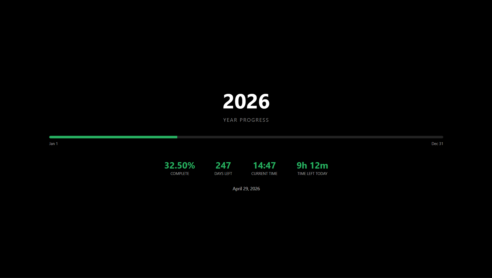

# Year Progress Tracker 📅

A minimalist, real-time dashboard designed to visualize the passage of time. This tool provides a high-level overview of the current year's progress, helping you stay mindful of your long-term goals and daily schedule.


## 📸 Preview


A visual representation of the year progress as seen in (yeartracker.png).

 
## Features

*   *Live Progress Visualization*: A dynamic progress bar showing the percentage of the year completed.
*   *Precision Tracking*: Real-time updates for the year percentage (to two decimal places).
*   *Time Management*: Displays "Days Left" in the year and a "Time Left Today" countdown to encourage daily productivity.
*   *Modern UI*: A sleek, distraction-free dark mode interface.
*   *Lightweight*: Zero dependencies; built purely with HTML, CSS, and Vanilla JavaScript.

##  Built With

*   *HTML5*: Semantic structure.
*   *CSS3*: Custom styling and responsive layout.
*   *JavaScript*: Logic for time calculations and DOM manipulation.

  ## 📦 Installation & Usage

1.  **Clone the repository:**
    ```bash
    git clone [https://github.com/Adhieeeh/Year-Progress-Tracker.git](https://github.com/Adhieeeh/Year-Progress-Tracker.git)
    ```
2.  **Navigate to the directory:**
    ```bash
    cd Year-Progress-Tracker
    ```
3.  **Open the project# Year Progress Tracker 📅
4.  **Open the project:**
    Simply open `index.html` in your favorite web browser.

## 📈 Roadmap

- [ ] Add customizable "Target Dates" (e.g., birthdays or project deadlines).
- [ ] Implement a toggle for Light/Dark mode.
- [ ] Add browser notifications for quarterly milestones.

## 🤝 Contributing

Contributions are what make the open-source community such an amazing place to learn, inspire, and create. Any contributions you make are **greatly appreciated**.

1. Fork the Project
2. Create your Feature Branch (`git checkout -b feature/AmazingFeature`)
3. Commit your Changes (`git commit -m 'Add some AmazingFeature'`)
4. Push to the Branch (`git push origin feature/AmazingFeature`)
5. Open a Pull Request
